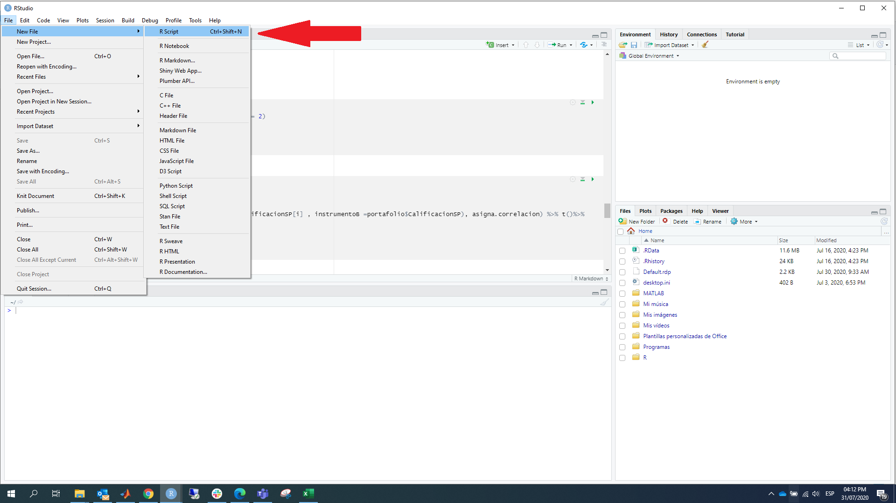
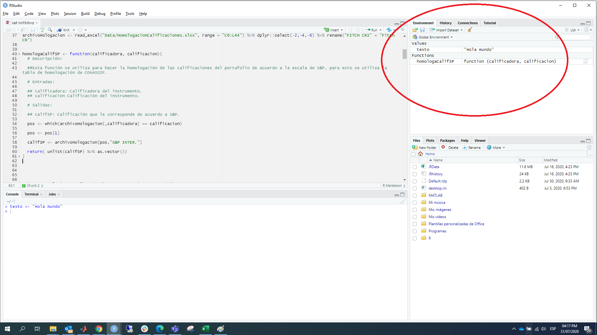

# **Primeros pasos con R y RStudio**

R es un entorno y lenguaje de programación con un enfoque al análisis estadístico

RStudio es un IDE por sus siglas en ingles Integrated Development Environment o Entorno De Desarrollo Integrado que facilita la interacción con el lenguaje de programación R y los procesos de carga de datos, instalación y administración de paquetes, exportación de gráficos y administración de archivos, entre otros.

El objetivo de este capítulo es conocer el entorno de trabajo que proporciona R y RStudio, además de aprender a instalar y cargar los paquetes que se necesiten para realizar análisis de datos.


## **Instalación**

### **R**
Para instalar R en Windows, la forma más simple es descargar la versión más reciente de R base desde el siguiente enlace de CRAN:

https://cran.r-project.org/bin/windows/base/

El archivo que necesitamos tiene la extensión **.exe** (por ejemplo 4.0.2-win.exe). Una vez descargado, lo ejecutamos como cualquier instalable.

Después de la instalación, estamos listos para usar R.

### **RStudio**

Para instalar RStudio, es necesario descargar y ejecutar alguno de los instaladores disponibles en su sitio oficial. Están disponibles versiones para Windows, OSX y Linux.

https://www.rstudio.com/products/rstudio/download/

Si ya hemos instalado R en nuestro equipo, RStudio lo detectará automáticamente y podremos utilizarlo desde este entorno. Si no instalamos RStudio antes que R, no hay problema, cada vez que iniciamos este programa, verificará la instalación de R.


## **Entorno de trabajo de RStudio.**

En general se trabaja con la interfaz de RStudio antes que con la de R porque la primera es mucho “más amigable”.

Al abrir RStudio veremos algo como esto:

```{r notas-curso-1-bis, include=FALSE}
options(tinytex.verbose = TRUE)
Sys.setlocale("LC_TIME", "es_ES")

```

```{r notas-curso-1, include=FALSE}
# setwd('/Users/tchavarria/Documents/GitHub/curso-programacion-basico-r-bn')
setwd(getwd())
```


```{r RStudio, echo=FALSE, out.width = "100%"}
knitr::include_graphics("images/entornoRStudio.png")
```

Una vez estamos en RStudio, podemos escribir y ejecutar las órdenes de varias formas:

- Directamente en la consola
- A través de un script (.R)
- Con ficheros Rmarkdown (.Rmd)


### **Consola de R**

La consola de RStudio nos permite interactuar con los comandos de R, es decir, ingresamos una instrucción en la consola y esta retornará el resultado de la ejecución de ese comando, aunque esta es una herramienta muy útil no es la mejor opción cuando nuestro código gana complejidad.

En la consola escribimos **expresiones**, el símbolo "<-" es el operador de asignación, aunque también se puede utilizar el símbolo "=".

**Asignación de valores.**
```{r notas-curso-2}
x <- 1  # Asignamos el valor 1 a la variable x

texto <- "Bienvenidos"  # Asignamos el valor "Bienvenidos" a la variable texto
```

En R el símbolo "#" indica que es un comentario, cualquier cosa que esté a su derecha (incluido el "#") será ignorado a la hora de ejecutar el código. Este es el único símbolo para hacer comentarios en R y además cabe mencionar que R no soporta comentarios en bloques o multilíneas.

**Evaluación.**

Cuando escribimos una expresión en la consola, podemos imprimir su valor sin una orden explícita.

```{r notas-curso-3}
x<- 13 # No imprime nada, solo asigna el valor
```


```{r notas-curso-4}
x # Se imprime el valor

print(x) # Orden explicita
```


### **Ayuda en R**

Al comenzar a trabajar con R necesitaremos información sobre cada instrucción,
función y paquete. Toda la documentación se encuentra integrada en RStudio, para accesar a esta información podemos usar la función **help()** o el signo de interrogación **?**, de la siguiente manera

```{r notas-curso-5, eval=FALSE}
help("funcion")

?funcion
??nombre_paquete
```

Al ejecutar estas instrucciones la información aparece en la pestaña de **help**.
```{r notas-curso-6, eval= FALSE}
help("read.table")

?read.table
```

### **Nombres en R**

Al igual que la documentación de nuestro código, es importante el nombre que le demos a nuestros objetos (variables, funciones). En **R** los nombres de los objetos deben comenzar con una letra y solo pueden contener letras, números y los signos : "_" , ".". Es bueno que los nombres sean descriptivos, es necesario adoptar una convención, la más común es la del guión bajo (snake_case) en la que los nombres se escriben en minúscula y separados por _ .

```{r notas-curso-7, eval=FALSE}

yo_uso_guion_bajo  ##snake_case

OtraGenteUsaMayusculas 

algunas.personas.usan.puntos ## Esto es peculiar de R, ya que en otros lenguajes el punto no se acepta en los nombres
                             ##ya que tiene otras funciones

Y_algunasPocas.Personas_RENIEGANdelasconvenciones

```

Generalmente las variables son sustantivos y el nombre de las funciones verbos, se debe procurar que los nombres sean concisos y con significado.

```{r notas-curso-8}
##Correcto

dia_uno <- 10

## Incorrecto

primer_dia_del_mes <- 10

```

También se debe evitar utilizar nombres de funciones o variables comunes, esto causa confusión al leer el código.

```{r notas-curso-9}

## Incorrecto

T <- FALSE
c <- 10

mean <- function(x){
  sum(x)
} 

```

Existen muchas otras buenas prácticas a la hora de escribir código en **R**, el siguiente link contiene una guía del estilo *tidyverse*.

https://style.tidyverse.org/index.html

### **Scripts de R**

Trabajar en la consola es muy limitado ya que las instrucciones se tienen que escribir una por una. Lo habitual es trabajar con scripts o ficheros de instrucciones. Estos ficheros tienen extensión **.R**.

Se puede crear una script con cualquier editor de texto, pero nosotros lo haremos desde RStudio. Para hacer esto, seleccionamos la siguiente ruta de menús: File > New File > R script


```{r script, echo=FALSE, out.width = "100%"}



```

### **Entorno**

El panel de entorno esta compuesto de dos pestañas: Environment y History.

En el entorno se irán registrando los objetos que vayamos creando en la sesión de trabajo: datos, variables, funciones. También tenemos la opción de cargar y guardar una sesión de trabajo, importar datos y limpiar los objetos de la sesión. Estas opciones están accesibles a través de las de opciones de la pestaña.


```{r Entorno, echo=FALSE, out.width = "100%"}


```

### **Directorio de trabajo**

El directorio o carpeta de trabajo es el lugar en la computadora en el que se encuentran los archivos con los que se van a  trabajar en R. Este es el lugar donde R buscara archivos para importarlos y al que serán exportados, a menos que indiquemos otra cosa.

Para encontrar cuál es el directorio de trabajo actual se utiliza la función **getwd()**.

```{r notas-curso-10}
getwd()
```
Se mostrará en la consola la ruta del directorio que está usando R.

Se puede cambiar el directorio de trabajo usando la función setwd(), dando como argumento la ruta del directorio que se desea utilizar.

```{r notas-curso-11, eval=FALSE}
setwd("otra_ruta")
```

## **Paquetes**

 Cada paquete es una colección de funciones diseñadas para atender una tarea específica. Por ejemplo, hay paquetes para trabajo visualización, conexiones a bases de datos, minería de datos, interacción con servicios de internet, entre otros.

Estos paquetes se encuentran alojados en CRAN, así que pasan por un control riguroso antes de estar disponibles para su uso generalizado.

Se pueden instalar paquetes usando la función **install.packages()**, dando como argumento el nombre del paquete que deseamos instalar, entre comillas.

Por ejemplo, para instalar el paquete **dplyr**, ejecutamos lo siguiente.

```{r notas-curso-12, eval=FALSE}
install.packages("dplyr") ## En general se escribe  install.packages("nombre_paquete")
```

Después de ejecutar esa instrucción, aparecerán algunos mensajes en la consola mostrando el avance de la instalación

Una vez concluida la instalación de un paquete, para poder utilizar sus funciones debemos ejecutar la función **library()** con el nombre del paquete que se quiere utilizar.

```{r notas-curso-13, eval=FALSE}
library(dplyr)   ## En general se escribe  library("nombre_paquete")
```


## **Scripts**

Los scripts son documentos de texto con la extensión de archivo .R, por ejemplo mi_script.R.

Estos archivos son iguales a cualquier documentos de texto, pero R los puede leer y ejecutar el código que contienen.

Aunque R permite el uso interactivo, es recomendable guardar el código en un archivo .R, de esta manera se puede utilizar después y compartirlo con otras personas. En general, en proyectos complejos, es posible que sean necesarios múltiples scripts para distintos fines.

Se pueden abrir y ejecutar scripts en R usando la función **source()**, esta recibe como argumento la ruta del archivo .R en nuestra computadora, entre comillas.

Por ejemplo.

```{r notas-curso-14, eval=FALSE}
source("C:/Proyecto/limpiezaDatos.R")
```

Cuando usamos RStudio y abrimos un script con extensión .R, este programa abre un panel en el que se puede ver su contenido. De este modo se puede ejecutar todo el código que contiene o sólo partes de él.


## **Shortcuts**

- Borrar toda la consola: CTRL + L.
- Ejecutar una línea o lo que se seleccione: CTRL+R

